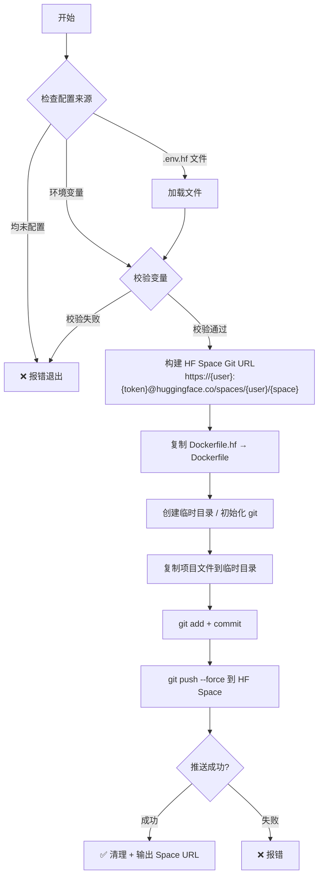

# HuggingFace Spaces 部署方案

## 概述

本项目通过 HuggingFace Spaces 部署 Docker 服务。HF Space 本质是一个 Git 仓库，推送 `Dockerfile` 后 HF 会自动构建镜像并运行。

项目已有 `Dockerfile.hf` 作为 HF 环境的 Docker 镜像定义，部署时将其复制为根目录 `Dockerfile`，连同源代码一起推送到 HF Space 仓库。

## 架构流程



## 部署配置（.env.hf）

| 变量 | 说明 | 示例 | 必需 |
|------|------|------|------|
| `HF_TOKEN` | HuggingFace Access Token | `hf_xxxxxxxxxxxxxxxxx` | ✅ |
| `HF_USERNAME` | HF 用户名或组织名 | `myuser` | ✅ |
| `HF_SPACE_NAME` | Space 名称 | `tarot-poster` | ✅ |

配置优先级：**环境变量 > .env.hf 文件 > 默认值**

部署配置存放在项目根目录 `.env.hf` 文件中（不提交到 Git），可从 `.env.hf.example` 复制：

```bash
cp .env.hf.example .env.hf
# 编辑 .env.hf 填入实际值
```

## 推送文件清单

只推送构建 Docker 镜像所需的最小文件集：

- `src/` — TypeScript 源代码
- `assets/` — 静态资源（SVG 素材）
- `scripts/` — 入口脚本（entrypoint.sh）
- `package.json` — 依赖声明
- `pnpm-lock.yaml` — 依赖锁定
- `tsconfig.json` — TypeScript 配置
- `Dockerfile` — 由 `Dockerfile.hf` 复制生成
- `.dockerignore` — Docker 构建忽略规则

以下文件不会被推送：
- `node_modules/` — HF 构建时会重新安装
- `dist/` — HF 构建时会重新编译
- `.env` / `.env.local` — 敏感信息
- `docker-compose.yml` / `Makefile` — 本地开发工具
- `test/` / `coverage/` — 测试文件
- `.git/` — 避免嵌套 Git 仓库

## 使用方式

### 前置条件

1. 在 [HuggingFace](https://huggingface.co/settings/tokens) 创建 Access Token（需要 write 权限）
2. 在 HuggingFace 上创建一个 Space，选择 **Docker** 模板，Space SDK 选 `Docker`
3. Space 的 visibility 可根据需要选择 public 或 private

### 配置部署信息

```bash
# 复制配置模板
cp .env.hf.example .env.hf

# 编辑 .env.hf 填入实际值
# HF_TOKEN=hf_xxxxxxxxxxxxxxxxx
# HF_USERNAME=your-hf-username
# HF_SPACE_NAME=tarot-poster
```

### Linux / macOS

```bash
# 方式一：通过 .env.hf 文件（推荐）
bash scripts/deploy-hf.sh

# 方式二：通过环境变量
HF_TOKEN=hf_xxxx HF_USERNAME=yourname HF_SPACE_NAME=tarot-poster bash scripts/deploy-hf.sh
```

### Windows

#### 批处理脚本（最简单）

1. 用文本编辑器打开 `scripts\deploy-hf.bat`
2. 修改以下三个变量：
   ```batch
   set "HF_TOKEN=hf_你的实际token"
   set "HF_USERNAME=你的用户名"
   set "HF_SPACE_NAME=你的space名称"
   ```
3. 双击运行或在命令行执行 `scripts\deploy-hf.bat`

#### PowerShell 脚本（推荐）

```powershell
# 复制配置模板
Copy-Item .env.hf.example .env.hf
notepad .env.hf  # 填入实际值

# 运行部署
.\scripts\deploy-hf.ps1

# 预览模式（不执行实际操作）
.\scripts\deploy-hf.ps1 -WhatIf
```

> **注意**：首次运行 PowerShell 脚本可能需要设置执行策略：
> ```powershell
> Set-ExecutionPolicy -ExecutionPolicy RemoteSigned -Scope CurrentUser
> ```

### 部署流程说明

1. 脚本从环境变量或 `.env.hf` 文件读取配置
2. 校验 `HF_TOKEN`、`HF_USERNAME`、`HF_SPACE_NAME` 是否已设置且非占位符
3. 将 `Dockerfile.hf` 复制为根目录 `Dockerfile`
4. 将必要的源文件复制到临时目录
5. 在临时目录初始化 Git，用 `HF_TOKEN` 作为密码认证
6. 强制推送到 `https://huggingface.co/spaces/{username}/{space-name}`
7. HF 收到推送后自动触发 Docker 构建和部署
8. 推送完成后自动清理临时文件

## 大文件处理策略

### 当前项目状态

当前推送文件总大小不到 500 KB（78 个 SVG + 源码 + 配置），完全不受 Git 限制影响，无需担心推送失败。

### Git 平台限制参考

| 平台 | 单文件限制 | 仓库总大小建议 |
|------|-----------|---------------|
| GitHub | 100 MB（超过会警告） | ≤ 1 GB |
| HuggingFace Spaces | 无严格限制 | 免费版总存储 10 GB |
| GitLab | 100 MB | ≤ 10 GB |

### 未来如引入大文件，推荐方案

如果后续需要加入中文字体（`.ttf` 通常 5-20 MB）、高清背景图等大文件，有三种处理方式：

#### 方案 A：Docker 构建时下载（推荐）

大文件不入 Git，在 `Dockerfile.hf` 中通过 `RUN wget` 或 `RUN curl` 下载。文件只进 Docker 镜像，Git 仓库保持轻量。

```dockerfile
# 示例：构建时下载中文字体
RUN mkdir -p /app/assets/fonts && \
    wget -O /app/assets/fonts/NotoSansSC.ttf \
    https://github.com/xxx/releases/download/v1.0/NotoSansSC.ttf
```

- ✅ 不影响 Git 推送，不受单文件大小限制
- ✅ HF Space 构建时会缓存该层（只要 URL 不变）
- ⚠️ 依赖外部下载源，若源不可用则构建失败

#### 方案 B：Git LFS（Large File Storage）

在 HF Space 上可用，适合 >50 MB 的单文件。

```bash
# 安装并配置 Git LFS
git lfs install
git lfs track "*.ttf" "*.png"
git add .gitattributes
```

- ✅ 对 Git 工作流透明
- ⚠️ HF Space 免费版 LFS 带宽有限
- ⚠️ 需要额外配置 `.gitattributes`

#### 方案 C：CDN / 对象存储

运行时从外部 URL 动态加载，既不进 Git 也不进镜像。

- ✅ 镜像最小，部署最快
- ⚠️ 增加运行时网络依赖
- ⚠️ 需要额外的存储服务

### 常见大文件来源及处理建议

| 文件类型 | 典型大小 | 推荐方案 |
|---------|---------|---------|
| 中文字体 `.ttf` / `.otf` | 5-20 MB | 方案 A（Docker 构建时下载） |
| 高清背景图 `.png` / `.jpg` | 2-10 MB | 方案 A 或 C |
| 多套字体（Light/Bold/Regular） | 合计 20-60 MB | 方案 A |
| 卡牌高清图（78 张 PNG） | 合计可能 50-200 MB | 方案 C（CDN） |
| `node_modules` | 几百 MB | 已在 `.gitignore` 中排除 |

## 注意事项

1. **首次部署**：需要先在 HF 上手动创建 Space，否则推送会失败
2. **强制推送**：脚本使用 `--force` 推送，每次都会覆盖 HF Space 仓库的全部内容
3. **环境变量**：HF Space 运行时需要的环境变量（如 `API_KEY`、`NODE_ENV` 等）需在 HF Space Settings 页面手动配置
4. **Token 安全**：`HF_TOKEN` 存放在 `.env.hf` 文件中，该文件已在 `.gitignore` 中排除，不会提交到 Git 仓库
5. **构建时间**：首次部署时 HF 需要拉取基础镜像并构建，可能需要几分钟
6. **跨平台**：Linux/macOS 使用 `deploy-hf.sh`，Windows 建议使用 `deploy-hf.ps1`（PowerShell）或 `deploy-hf.bat`（批处理）
